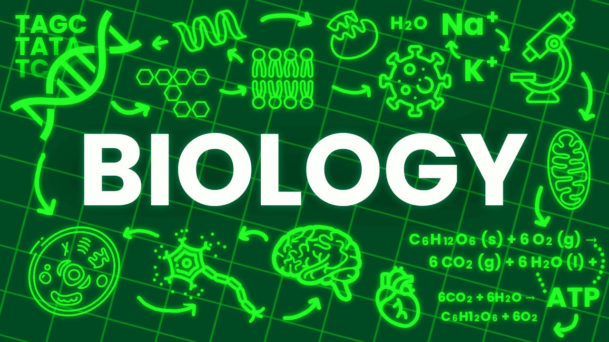

<!DOCTYPE html>
<html lang="en">
<head>
    <meta charset="UTF-8">
    <meta name="viewport" content="width=device-width, initial-scale=1.0">
    <title>Dariush Bahman</title>
    
</head>
<body>
    

        <h1>Welcome Dariush Bahmani</h1>
        <h2>This page is only an example of the presentation(s) and does not have specific content.</h2>
        
        

            
            
            
            
            
        

        
        

    

</body>
</html>
